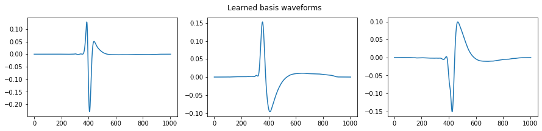
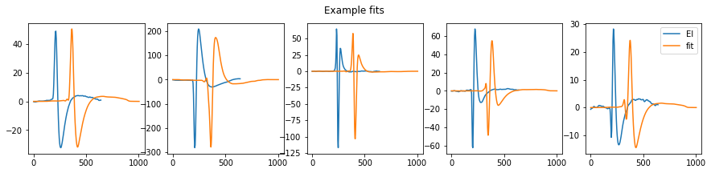
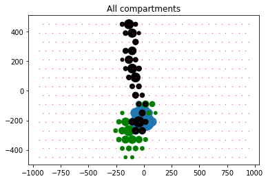
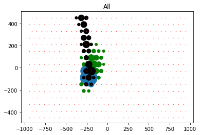

# Optimization-based EI compartment decomposition

## Description
This algorithm decomposes the EIs into scaled and shifted superpositions of basis waveforms by iteratively optimizing
over the (time shifts, amplitudes) and waveform shapes in alternating steps. The algorithm performs the optimization over
an entire population of cells (for example, all sufficiently large amplitude electrodes for ON parasols in a given recording
are handled at the same time). In the new and improved version, the initial waveform shapes for the optimization are calculated
by PCA clustering of the recorded waveforms or by manually selecting representative electrodes for soma, axon, and dendrite. 
This allows for better fits and more stable and repeatable results when compared with random initialization.

The algorithm appears to perform reasonably for all four major cell types. Fits for large cells need to be checked
over carefully, and amacrines are not fit well at all (EIs for amacrines are not well defined)

The best way to run the entire pipeline is to write a wrapper shell script (see example.sh). There are several data
preparation steps, and different methods for initializing the waveforms require different scripts. If L1L2 group sparsity
regularization is desired, manual intervention part way through the process will be necessary to assign the groups.

#### Dependencies:
* artificial-retina-software-pipeline (visionloader)
* pytorch >= 1.5
* numpy, scipy
* sklearn

This runs on GPU only; I have never tried it on CPU and it would likely be intolerably slow on CPU.

#### Example learned basis waveforms (randomly initialized)



#### Example fits for several electrodes

Blue is ground truth, orange is the fit.



#### Decomposition of example cells into compartments

Size of circle represents relative amplitude of each compartment. Blue is somatic,
green is dendrite, black is axonic. Note that each given electrode could have axonal, dendritic, and somatic contributions.



## How it works

The algorithm has the following steps

1. Initialize the basis waveforms. This can be done automatically with PCA clustering or with random initialization. Alternatively,
the user can manually specify the waveforms.
2. Iteratively fit by alternating between the following two steps
    1. Given fixed basis waveforms, jointly solve for the scaling amplitudes and time shifts on each basis waveform. This is formulated 
    as nonnegative least squares (the amplitudes must be nonnegative), with optional L1 regularization to promote sparsity
    among the amplitudes (electrodes often tend be just one compartment, for example, pure axonic electrodes). The problem is separable
    over each (cell, electrode) pair, and it is solved in parallel for each. To deal with the time shifts, the algorithm performs
    a two-pass parallel grid search over the range of possible shifts for each basis waveform.
    2. Given fixed amplitudes and time shifts, solve for the basis waveforms in Fourier domain. Because this problem is solved
    in Fourier domain (convenient for dealing with the time shifts, because in Fourier domain the shifts become elementwise
    multiplication), the problem is formulated as complex linear least squares, with an extra factor to account for the shifting.
    The problem is separable over each frequency, and is solved in parallel for each.
    
There is a document with mathematical details... The details are quite unpleasant...

## Component scripts

### Specifying which cells to decompose

A .csv file containing a list of cell ids is necessary to specify which cells the decomposition is applied to. This .csv
has format

```
1,2,3,4,5,6,7,8,9,10
```

where each number is a cell id. All relevant cell ids are contained in a single line, and are separated by commas. 

This file can be manually generated, or can be automatically generated from an existing Vision cell type classification
using the following two scripts.

#### generate_typed_cell_id_list.py

This script generates a .csv file where the relevant cell ids are all cells that exactly match a specified
cell type from an existing Vision cell type classification. For the major cell types, you will likely want to
use this method.

##### SYNOPSIS
```shell script
python generate_typed_cell_id_list.py <Vision-ds-path> <Vision-ds-name> <path-to-output-csv> <Cell-type-name>
```

##### Example usage:
This command exports cell ids of all ON parasols in the dataset and saves it in `path/to/your/csv`
```shell script
python generate_typed_cell_id_list.py /Volumes/Analysis/9999-99-99/data000 data000 path/to/your/csv "ON parasol"
```


#### generate_typed_prefix_cell_id_list.py

This script generates a .csv file where the relevant cell ids correspond to cells whose cell type name begins with
the specified prefix (i.e. if you have "ON parasols" and "ON midgets" and you specify "ON" as the prefix, this will
grab both ON parasols and midgets). This is useful for wrangling with more complicated cell type classifications for large
cells, where the relevant cells may be in different subcategories.

##### SYNOPSIS
```shell script
python generate_typed_prefix_cell_id_list.py <Vision-ds-path> <Vision-ds-name> <path-to-output-csv> <Cell-type-prefix>
```


##### Example usage:
This command exports cell ids of all cells whose type name begins with "OFF SM combine" in the dataset and saves it in `path/to/your/csv`
```shell script
python generate_typed_prefix_cell_id_list.py /Volumes/Analysis/9999-99-99/data000 data000 path/to/your/csv "OFF SM combine"
```

### Extracting the relevant data from Vision

#### create_data_pickle.py

This command extracts the EIs for the relevant cells from Vision and saves the result as a pickle file. The output
of this script is the data source for the main optimization routine.

##### SYNOPSIS
```shell script
python create_data_pickle.py <Vision-ds-path> <Vision-ds-name> <path-to-input-csv> <path-to-save-data pickle>
```

##### Example usage 

This extracts and saves the EIs for the cell ids specified in `path/to/your/csv` into a pickle file located at `path/to/save/data_pickle.p`

```shell script
python create_data_pickle.py /Volumes/Analysis/9999-99-99/data000 data000 path/to/your/csv path/to/save/data_pickle.p
```

### Initializing waveforms (optional but strongly recommended)

There are two ways to generate initial waveform shapes for the compartments before the main optimization (You can also
learn the waveform shapes de novo during the main optimization, but this generally gives crummier and less repeatable 
results). These methods are (1) time-shift alignment of waveforms followed by PCA clustering; and (2) Manual selection of
representative compartment waveforms.

#### pca_init_basis_waveforms.py

Time-shift alignment of waveforms followed by PCA clustering: this method works by temporally shifting each waveform
such that the maximum deviation from zero occurs at the same time (i.e. aligning the peaks), renormalizing all of the wavforms
such that they have L2 norm 1, performing PCA and EM clustering with 3 cluster centers, and then reading off the cluster means
as the initial basis waveforms.

This method works really well for the four major cell types, where the compartment waveforms are reasonably well defined
and temporal alignment is easy. This works less well for the rare cell types, probably because temporal alignment of the peaks
is very tricky when most electrodes contain a superposition of basis waveforms.

##### SYNOPSIS
```shell script
python pca_init_basis_waveforms.py <input-data-pickle> <output-basis-pickle> [optional-one-letter-args]
```

##### Optional arguments
* --upsample, -u, integer value, default 5. Upsample factor. For example, 5 corresponds to bspline interpolation + 5x upsampling. This parameter
is shared with the main optimization, and  setting the parameter here corresponds to setting it for the main optimization
* --before, -b, integer value, default 100. Number of upsampled samples to zero pad the front of the EI. Also corresponds to the lower
bound for the range of shifts that the main optimization considers when doing temporal alignment. This parameter
is shared with the main optimization, and  setting the parameter here corresponds to setting it for the main optimization
* --after, -a, integer value, default 100. Number of upsampled samples to zero pad the back of the EI. Also corresponds to the lower
bound for the range of shifts that the main optimization considers when doing temporal alignment. This parameter
is shared with the main optimization, and  setting the parameter here corresponds to setting it for the main optimization
* --thresh, -t, float value, default 5.0. Mininum deviation from zero required to include an electrode in the calculation. This parameter
is shared with the main optimization, and  setting the parameter here corresponds to setting it for the main optimization
* --alignment_sample, -l, integer value, default 200. Sample number to align the peak to. **Adjust this value if the waveforms
are cut off in time**
* --nbasis, -n, integer value, default 3. Number of basis waveforms (cluster centers). Should be 3, unless you have some other
decomposition in mind that isn't (soma, dendrite, axon)
* --n_pca_components, -p, integer value, default 5. Number of dimensions for the PCA.

##### Example usage

This does clustering for all of the cells in `input/data_pickle.p`, and upsamples 5x, and pads 100 zero samples at the front
and 200 zero samples at the back of each waveform, and saves the resulting waveforms to `output/basis_pickle.p`

```shell script
python pca_init_basis_waveforms.py input/data_pickle.p output/basis_pickle.p -u 5 -b 100 -a 200
```

#### save_initialized_waveforms_basis.py

This allows the user to manually select basis waveforms. For rare cell types, this is likely what you will want to use.

##### SYNOPSIS
```shell script
python save_initialized_waveforms_basis.py <input-data-picle> <output-basis-pickle> -c <selected-cell-id> -e <selected electrode sequence> [optional-one-letter-args]
```

##### Mandatory flag arguments
* --cell_id, -c, integer value. The cell id of the cell that you want to take basis waveforms from
* --electrodes, -e, sequence of integers. The indices of the electrodes corresponding to the basis waveforms. Zero-indexed.

##### Optional arguments
* --upsample, -u, integer value, default 5. Upsample factor. For example, 5 corresponds to bspline interpolation + 5x upsampling. This parameter
is shared with the main optimization, and  setting the parameter here corresponds to setting it for the main optimization
* --before, -b, integer value, default 100. Number of upsampled samples to zero pad the front of the EI. Also corresponds to the lower
bound for the range of shifts that the main optimization considers when doing temporal alignment. This parameter
is shared with the main optimization, and  setting the parameter here corresponds to setting it for the main optimization
* --after, -a, integer value, default 100. Number of upsampled samples to zero pad the back of the EI. Also corresponds to the lower
bound for the range of shifts that the main optimization considers when doing temporal alignment. This parameter
is shared with the main optimization, and  setting the parameter here corresponds to setting it for the main optimization
* --thresh, -t, float value, default 5.0. Mininum deviation from zero required to include an electrode in the calculation. This parameter
is shared with the main optimization, and  setting the parameter here corresponds to setting it for the main optimization
* --alignment_sample, -l, integer value, default 200. Sample number to align the peak to. **Adjust this value if the waveforms
are cut off in time**

##### Example usage

This grabs data from electrodes 10, 11, and 12 from cell 256, upsamples 5x, and pads 100 zeros at the front and 200 zeros
at the back of every waveform, and saves the resulting waveforms to `output/basis_pickle.p`

```shell script
python save_initialized_waveforms_basis.py input/data_pickle.p output/basis_pickle.p -c 256 -e 10 11 12 -b 100 -a 200 -u 5
```

#### Inspecting the output of the initialization step

### Saving groups for group sparsity

If you are using the group sparsity L1 penalty, you have to manually specify the groups. Since the PCA clustering method
outputs basis vectors in random order, manual inspection and annotation is necessary.

#### assign_basis_groups.py

The input csv each group on a different line, and the indices within each group separated by a comma. For example,

```shell script
0
1,2
```

corresponds to two groups. The first group contains basis waveform 0 alone, and the second group contains basis waveforms
1 and 2 together.

##### SYNOPSIS

```shell script
python assign_basis_groups.py <basis-pickle-path> <group-csv-path>
```

##### Example usage

This updates an already existing basis pickle at `input/basis_pickle.p` with the group assignments found in `input/group_assignment.csv`.

```shell script
python assign_basis_groups.py input/basis_pickle.p input/group_assignment.csv
```

### Running the main optimization

`two_stage_fourier_decomp` is the main decomposition program. This performs the iterative optimization of time shifts, amplitudes,
and waveforms, with optional regularization penalties for (group) sparsity for the amplitudes and for excessive curvature
of the basis waveforms.

There is no spatial regularization in this version. I am currently working on a version with a spatial penalty, but the 
spatial penalty as I've currently formulated it gives fairly lousy results.

#### two_stage_fourier_decomp.py

##### SYNPOSIS
```shell script
python two_stage_fourier_decomp.py <input-data-pickle> <output-decomp-pickle> [optional-one-letter-arguments]
```

##### Optional arguments

Arguments that you might want to fiddle with are bolded. The others are less immediately useful.

* **--initialized_basis, -i,  path to basis pickle file. Used if the basis waveforms are pre-initialized either manually
or with PCA. If not specified, the algorithm uses random initialization**
* **--weight_reg, -w, float valued. The lambda scaling value for L1 or group L1 regularization**
* **--sobolev_reg, -s, float-valued. The lambda scaling value for the waveform curvature penalty. Default not used**
* **--group, -g. Bool. Whether or not to use group L1 regularization instead of L1. Use group if specified**
* **--maxiter, -m. Int-valued. Number of iterations of the optimization loop to run. Default 10, but usually 5 or so should
suffice**
* **--renormalize_loss, -r, Bool. Renormalizes the loss contribution of each individual electrode such that each electrode
contributes an approximately equal amount to the waveform shape MSE loss when optimizing the basis waveform shapes. Default False,
but you should probably set it to True**
* **--renormalize_penalty, -p, Bool. Renormalizes the regularization terms such that the magnitude of the regularization term
has approximately the same ratio to the MSE contribution. Default False, but you should probably set it to True**
* --nbasis, -n, int-valued. Number of basis waveforms. Not used if basis waveforms were pre-initialized
* --upsample, -u, integer value, default 5. Upsample factor. For example, 5 corresponds to bspline interpolation + 5x upsampling. Only
matters if basis waveforms were not pre-initialized, since otherwise this parameter will have already been set.
* --before, -b, integer value, default 100. Number of upsampled samples to zero pad the front of the EI. Also corresponds to the lower
bound for the range of shifts that the main optimization considers when doing temporal alignment. Only
matters if basis waveforms were not pre-initialized, since otherwise this parameter will have already been set.
* --after, -a, integer value, default 100. Number of upsampled samples to zero pad the back of the EI. Also corresponds to the lower
bound for the range of shifts that the main optimization considers when doing temporal alignment. Only
matters if basis waveforms were not pre-initialized, since otherwise this parameter will have already been set.
* --thresh, -t, float value, default 5.0. Mininum deviation from zero required to include an electrode in the calculation. Only
matters if basis waveforms were not pre-initialized, since otherwise this parameter will have already been set.
* --grid_step, integer value, step size for the grid search
* --grid_top_n, integer value, neighborhood around best N time shifts from the grid search is fine searched in the second pass
* --fine_search_width, integer value, width of the neighborhood to do the fine search in
* --grid_batch_size, integer value, GPU batch size. 8192 by default, make smaller if you run out of GPU memory, bigger may 
increase speed but not by much.
*--eps_cutoff, -e, float value, Convergence criteria

##### Example usage

This performs the decomposition of EIs in `input/data_pickle.p` using the basis vectors in `input/basis_pickle.p`, saves the
output into `output/decomp_output.p`. It uses group sparsity L1 with a lambda of 1e-2, and does renormalization for both the MSE
loss and for the regularization terms. This performs three iterations of the optimization.

```shell script
python two_stage_fourier_decomp.py input/data_pickle.p output/decomp_output.p -i input/basis_pickle.p -w 1e-3 -r -g -m 4
```

## Outputs

The output values are stored in a Python pickle file. The pickle file contains two distinct dictionaries. These dictionaries
must be loaded with consecutive calls of ```pickle.load()```.
1. The first dictionary is the optimization parameter dictionary. It contains all of the optimization hyperparameters for
record-keeping.
2. The second dictionary contains the results of the optimization. The keys in this dictionary are:
    * ```'mse'```: -> ```Dict``` the final MSE values over all waveforms at the end of the optimization
    * ```'waveforms``` -> ```np.ndarray``` the basis waveforms found by the optimization. Has shape ```(n_basis_waveforms, n_timepoints)```
    Note that because the waveforms are fit from random initialization, the compartments will occur in random order.
    * ```'decomposition'``` -> ```Dict[int, Tuple[np.ndarray, np.ndarray]]``` Dict mapping cell id integer to the decompositions.
    The first ```np.ndarray``` contains the amplitudes, and has shape ```(n_electrodes, n_basis_waveforms)```, with the order of
    the columns corresponding to the order of basis waveforms in ```waveforms```. The second ```np.ndarray``` contains the shifts,
    in units of supersampled samples, and has shape ```(n_electrodes, n_basis_waveforms)```. The order of the columns corresponds
    to the order of the basis waveforms in ```waveforms```. Negative is forward shift, and positive is a delay.
